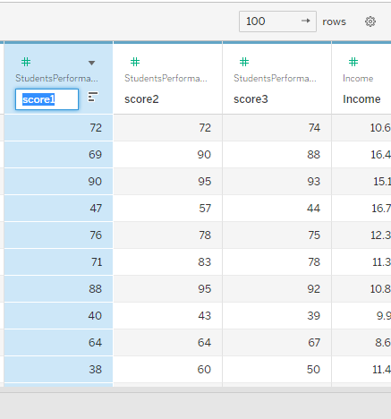
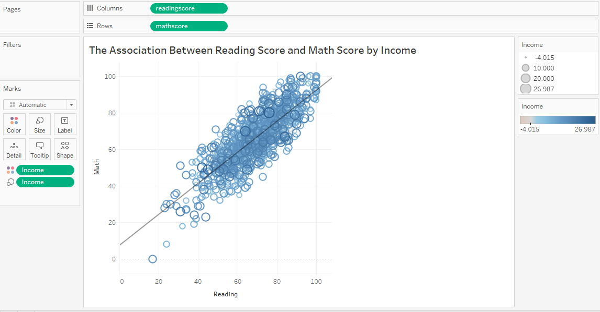

## Grapical Representation of Association between Numerical and Mixed Data and More Fancy Visuals

### Jittering Scatter Plot

Scatter plots are mostly used to represent the association between two continuous variables. However, it is also applicable when the independent variable (x-axis) is discrete that is almost continuous such as years, classes etc. In this case, you may also prefer boxplot for visualization but it may be hard to understand and explain.

As stated before, the scatter plot also suffer from overplotting problems due to the high number of observations with exactly the same values, which frequently occurs when x-axis represent a discrete variable that is almost continuous.

To overcome this problem and represent the relationship between them, small random values are added to the coordinates of the points to separate them which is called **jittering**. Note that this can work only for data set that are not really large.

**Example:** Consider that data sets including information of over ten thousands athletes in London Summer Olympics of 2012.

```{r, echo=FALSE, message=FALSE, error=FALSE, warning=FALSE}
library(ggplot2)
library(ggthemes)
data(oly12, package = "VGAMdata")
knitr::kable(head(oly12))
```

Look at the relationship between age and weight.

```{r, echo = FALSE,warning=FALSE,message=FALSE}
ggplot(oly12,aes(Age,Weight))+geom_point()+
labs(title ="The association between age and weight\nfor the athletes at the London Olympics 2012", x= "Age", y= "Weight")+theme_fivethirtyeight()+theme(rect = element_rect(fill ="white"),axis.title = element_text(face = "bold",size =10),plot.title = element_text(size = 12))
```

In this plot, the variable on the x-axis is discrete that is almost continuous. Also, there is a serious over plotting problem. If we jitter this plot.

```{r, echo = FALSE,warning=FALSE,message=FALSE}
ggplot(oly12,aes(Age,Weight))+ geom_jitter(width = 0.65)+
labs(title ="The association between age and weight\nfor the athletes at the London Olympics 2012",subtitle = "Jittered Scatter Plot", x= "Age", y= "Weight")+theme_fivethirtyeight()+theme(rect = element_rect(fill ="white"),axis.title = element_text(face = "bold",size =10),plot.title = element_text(size = 12))
```

As seen that we have still over plotting problem since we have large dataset, but the association between them can be understood better.

**Interpretation:** The plot shows that the there is an increasing relationship between age and weight until age 30's, then there is no obvious association between these two variables. Also, we can see some extreme observation in the interval where we have an association.

### Comperative Scatter Plot

Sometimes, you would like to investigate the relationship between two continuous variable under some conditions, which is generally a categorical variable with at least 2 levels. If you draw a scatter plot for each level of the categorical variable separately, it is called **comparative scatter plot** and it is mainly used for comparison.

Remember that we observe an approximately positive linear association between height and weight of the athletes at the London 2012.

**Question:** Is this comment working for gender?

```{r, echo = FALSE}
ggplot(oly12,aes(Height,Weight))+geom_point()+
labs(title ="Athletes at the London Olympics 2012", x= "Height", y= "Weight")+theme_fivethirtyeight()+theme(rect = element_rect(fill ="white"),axis.title = element_text(face = "bold",size =10),plot.title = element_text(size = 13))+facet_wrap(~Sex)
```

**Interpretation:** The expected relationship between weight and height can be clearly seen for both sex, which is an approximately positive linear association, although it is a little obsecured by some outliers, which distort the scales. There is evidence of discretiastion in the height measurements and the same effect would be visible for the weight measurements but for the outliers. Given the large number of points there is also a lot of overplotting, and most of the points in the middle of the plot represent more than one case.

### Scatter Plot Matrix

The graphical distribution of the data displays the story of the data by spending less cognitive effort.

If your dataset has more than 2 quantitative variables, you can construct a scatter plot matrix to understand the underlying relationship between them instead of drawing a scatter plot for each pair of the variables one by one.

```{r,echo=FALSE,warning=FALSE,message=FALSE}
sub_oly12 <- oly12[,3:5]
GGally::ggpairs(sub_oly12)+
labs(title ="Scatter Plot Matrix")+theme_fivethirtyeight()+theme(rect = element_rect(fill ="white"),axis.title = element_text(face = "bold",size =10),plot.title = element_text(size = 13))
```

### Bubble Chart

The scatter plot displays the relationship between two quantitative variables. What if we would like to display the association between three numerical variables?

A bubble plot, which is an extension of the scatter plot, displays the relationship between three numerical variables.

Point size are used to represent the value of the **non-negative** third variable.

It can be quite useful for smallish datasets without too much overlapping. [Rosling, 2013]

The one of the most famous example of bubble plot is the relationship between economical growth and life expectancy with respect to country population.

```{r, echo=FALSE,warning=FALSE,message=FALSE,error=FALSE}
library(dplyr)

# The dataset is provided in the gapminder library
library(gapminder)
data <- gapminder %>% filter(year=="2007") %>% dplyr::select(-year)

# Most basic bubble plot
data %>%
  arrange(desc(pop)) %>%
  mutate(country = factor(country, country)) %>%
  ggplot(aes(x=gdpPercap, y=lifeExp, size=pop, color=continent)) +
    geom_point(alpha=0.5) +
    scale_size(range = c(.1, 24), name="Population (M)")+labs(title = "The Country Development", x = "GDP Per Capita",y ="Life Expectancy")+theme_fivethirtyeight()+theme(rect = element_rect(fill ="white"),axis.title = element_text(face = "bold",size =10),plot.title = element_text(size = 13))
```

**Interpretation:** It is seen that the life expectancy shows an increasing pattern when GDP per capita is between 0 and 20000\$. On the other hand, we see that most of the countries with high life expectancy has a smaller population. We can also see that most of the countries with high life. exp are from Europe while the ones with low life exp. are from Africa.

## More Fancy Visuals

### Violin Plot

We know that box plot is an efficient tool for identifying the outliers. Although it is sometimes used to describe the distribution of the variable, but it might be an inappropriate tool when the variable has multimodal distribution.

The combination of box-plot and the kernel density esitimates is called violin plot which are used for both identifying outliers and displaying the distribution of the numerical variables.

The density estimates are plotted to mirror each other around an invisible central line in violin chart. Note that it can be more difficult for audience to understand although it is richer than box plot.

```{r, echo = FALSE,warning=FALSE,error=FALSE}
ggplot(oly12,aes(x= factor(1),y= Height))+geom_violin(width=1.1)+geom_boxplot()+
  labs(title = "The Violin Plot of Height of Athletes at London 2012",x = " ",y="Height")+theme_fivethirtyeight()+theme(rect = element_rect(fill ="white"),axis.title = element_text(face = "bold",size =10),plot.title = element_text(size = 13))
```

**Interpretation:** The plot shows that the height of the athletes at London 2012 has bimodal distribution. It is also seen that the median height is 1.75. We also observe some outlier values which are close to 2.25 and below 1.50.

##  {.tabset .tabset-pills .tabset-fade}

### Exercise 1

Lollipop chart can be used instead of

a)  Histogram

b)  Bar Plot

c)  Box Plot

d)  Stacked Bar Plot

### Answer

The correct answer is b. Lollipop chart is basically bar plot where the bars are transformed into a line and a dot.

## 

### Dumbbell Plots

Dumbbell plot is an alternative to clustered bar chart. It is also known as DNA Plot where they display the change between two data points.

It is also useful for comparison of the differences, ranges, spread or the distance between points.

{width="437"}

**Interpretation:** The graphic shows that the highest difference in ordered products between males and females in Turkey belongs to cosmetics, beauty, and health products.

##  {.tabset .tabset-pills .tabset-fade}

### Exercise 2

The following dumbbell plot related to the contribution of the American donors to election campaign is taken from [The Economist](https://www.economist.com/graphic-detail/2022/10/17/with-their-wallets-americans-are-voting-for-democratic-senate-candidates). Interpret the plot.


### Answer

With their wallets, American donors seem to be expressing a preference for Democratic Senate candidates over Republican ones. The contribution of the donors exceeds the predictions, except Washington.

## Introduction to Data Visualization with Tableau

Tableau is a visual analytics platform transforming the way we use data to solve problems---empowering people and organizations to make the most of their data. ( [Tableau](https://www.tableau.com/why-tableau/what-is-tableau) )

Tableau is basically VizQL, a visual query language, that translates mouse inputs like drag-and drop into database queries. Thereby, the users can explore the data quickly and share their findings.

There are several products of Tableau where most of them are required a payment.

-   **Tableau Prep** allows users to combine, shape, and clean their data from a variety of sources.

-   **Tableau Desktop** is the main platform for visualizing and analysing data and turning them into interactive dashboards and reports.

-   **Tableau Online** allows you to publish your work online and share it with anyone you give access to.

-   **Tableau Server** gives you more control over who can see your work, and it is usually used to share data within an organization.

-   **Tableau Public** is a free service that allows you to create data visualizations from limited sources that must be published to the public server.

The installation of the Tableau is an easy and quick process. You can download exe file from [here](https://www.tableau.com/products/desktop/download). Then, just follow the instructions.

When you launch Tableau Desktop, the first thing you will see is the start screen with different data types In the Connect panel on the left, you can select a file or a server as a data source.


In this class, we will consider "StudentPerformance.xlsx" dataset which represents the scores from three exams and a variety of personal, social, and economic factors that have interaction effects upon them. The data set can be also accessible from [here](http://roycekimmons.com/tools/generated_data/exams).


Then, Tableau will switch to the Data Source panel where the list of the excel sheets in the data are listed on the left‐hand side.


Dran and drop **StudentPerformance** sheet onto the white space in the top half of the screen. Drag and drop the Orders sheet onto the white space in the top half of the screen.


In the bottom half of the screen, you will now see a preview of the data. In this preview, the type of the data are represented in addition to the values and columns.


The data set we are working with has also another sheet; **Income**. Tableau enables us to create one data set by merging the sheets in the file.

Now, we are joining **StudentPerformance** and **Income** sheets. Note that the sheets must have a common column for joining process.


Then, the data set looks like as follows.


We have two id columns, so we can hide one of them by clicking on hide option.


The data has three scores, which are math, reading and writing. However, the column names do not show which one is which one. Tableau provides the column name manipulation in an easy way. It is enough to click on the column name that you want to change.

Similarly, you can change the type of the variables by clicking on the data type icon.



Finally, click Sheet 1 in the tabs bar at the bottom of the window, to create your first Tableau worksheet.

Now that you have connected to a data source and opened your first worksheet, it's time to become familiar with the Tableau interface.


The still‐blank canvas (1), as it is called, includes the title Sheet 1 (2). On the left, you will find the Data pane (3) . The tab next to it opens the Analytics pane. In Tableau, most interactions are achieved by dragging and dropping items onto the canvas. This makes interacting with Tableau easy and intuitive. Both dimensions (4) (including hierarchical dimensions [5]) and measures (6) can be moved directly onto it. Alternatively, they can be placed on the Columns (7) and Rows (8) shelves, in order to add them to your visualization. Fields from the Data pane can also be placed onto the Marks (9), Filters (10), and Pages (11) cards: for example, to change the color of marks or to only display marks for a filtered‐out subset of the data.

Show Me panel represents the suitable visuals for the chosen variable.

The tabs bar at the bottom of the screen allows you to go back to the data source editor (12) and to toggle between your different worksheets (13), each containing a single visualization. With the three buttons to the right of the tabs, you can open additional worksheets, new dashboards, and stories, respectively.

At the top of the screen, you can find the menu bar (14) and directly under that is the toolbar (15), with three important buttons:

-   The Tableau icon: This brings you back to the start screen, where, among other things, you can add additional data sources.

-   Undo: This allows you to go back a step so you can safely try out different ideas. You can go back as many steps as you like.

-   Redo: This allows you to restore any undone actions.

Before starting the visualization, you need to know the aggregation functions in Tableau. This functions are the SQL functions.

In Tableau, we use aggregate functions to summarize or change the granularity of the data.

| Function | Syntax           | Definition                                                                                                                  |
|-----------|-----------|--------------------------------------------------|
| ATTR     | ATTR(exp.)       | Returns the value of the expression if it has a single value                                                                |
| AVG      | AVG(exp.)        | Returns the average of all the values in the expression. AVG can be used with numeric fields only. Null values are ignored. |
| COLLECT  | COLLECT(spatial) | An aggregate calculation that combines the values in the argument field. Null values are ignored.                           |
| CORR     | CORR(exp1,exp2)  | Returns the Pearson correlation coefficient of two expressions.                                                             |
| COUNT    | COUNT(exp)       | Returns the number of items in a group. Null values are not counted.                                                        |
| COUNTD   | COUNTD(exp)      | Returns the number of distinct items in a group. Null values are not counted.                                               |
| COVAR    | COVAR(exp1,exp2) | Returns the sample covariance of two expressions.                                                                           |
| STDEV    | STDEV(exp)       | Returns the statistical standard deviation of all values in the given expression based on a sample of the population        |
| STDEVP   | STDEVP(exp)      | Returns the statistical standard deviation of all values in the given expression based on a biased population.              |
| SUM      | SUM(exp)         | Returns the sum of all values in the expression. SUM can be used with numeric fields only. Null values are ignored.         |
| VAR      | VAR(exp)         | Returns the statistical variance of all values in the given expression based on a sample of the population.                 |
| VARP     | VARP(exp)        | Returns the statistical variance of all values in the given expression on the entire population.                            |

The aggregate calculation is created by selecting **Analysis** \> **Create Calculated Field**. Then, we name the calculated field and enter the formula. The manual aggregate calculation is useful especially displaying the **text** variables.

{width="359"}

### Creating Visuals in Tableau 

Now that you are familiar with the Tableau interface and know where to find measures and dimensions in the Data pane, you can finally get started with your first data visualization! Often it makes sense to start a visualization by adding a measure to the view.

Consider the Student Performance data set, and answer the following questions by drawing the appropriate graphics on Tableau.

**What is the distribution of income with respect to parents education?**

To do this, drag the Income measure onto the left side of the canvas, to the vertical area labeled Drop Field Here.


Having visualized your first measure, you can now break it down using one of the dimensions, which is parents education.


We can add title by clicking on default Sheet 1 text.


You can also add caption to your plot. by right click on the blank canvas.


You can change the color of your objects (bar, bin, point etc) by using color option under Marks.


So, we have created our first plot. Let's continue then.

**What is the distribution of gender?**

Since gender is a categorical variable, we can use bar plot to visualize this. If we drag and drop gender variable onto row or column bar, we cannot draw a plot we desire. To overcome this problem we calculate the count of it. Then, separate this count by levels.


If you drag and drop the new aggregated variable on the row bar, you have total count of the variable.


**What is the distribution of the reading score?**

Since reading score is an quantitative variable, we can use histogram to characterize the distribution. To do so, just select readingscore variable and select histogram on Show Me window.


After some manipulation, we have


**Interpretation:** We can see that most of the grades are between 70-75. The reading score has left skewed distribution with an outlier observation around 15.

**What is the association between reading score and math score?**

Since both variables are quantitative, we can explore the relationship between them by using scatter plot.


```{r gif_example1, echo = FALSE, out.width='100%'}
my_gif = 'https://media.tenor.com/6xd1kGTGV-EAAAAC/houston-we-have-a-problem-tom-hanks.gif'
if (knitr::is_html_output()){
  knitr::include_graphics(my_gif)
} else {
  message("Sorry, this GIF is only available in the the HTML version of the notes.")
}
```

**Solution:** Click \_\_\_\_\_\_\_\_\_\_\_\_\_\_\_ and then \_\_\_\_\_\_\_\_\_\_\_\_\_\_\_\_\_\_


**Interpretation:** As we expected, the plot represents almost perfect positive linear relationship although some outliers attempt to distort it. On the average, we expect that a student with high reading score will have a high math. score.

**What is the distribution between reading score and math score with respect to income?**

Here, we will include the third variable, income. Since we are looking for the association of three numerical variables whose values are greater than 0, we can create a bubble chart by drag and drop the third variable onto size option under marks.



**Interpretation:** We can see that the relationship between mathematics and reading score does not show a specific pattern by income values.

```{r gif_example2, echo = FALSE, out.width='100%'}
my_gif = 'https://y.yarn.co/6818d891-04b9-498d-ad27-e15bb8a23cad_text.gif'
if (knitr::is_html_output()){
  knitr::include_graphics(my_gif)
} else {
  message("Sorry, this GIF is only available in the the HTML version of the notes.")
}

```

### Exercise 3

Consider the data set we have used above, and answer the following questions.

**What is the association between reading score and writing score of the male students?**

The expected output:


**What is the association between reading and math score for each gender?**

The expected output:


**How does the reading score distribute by parents education?**

The expected output:


**What is the association between gender and test preparation course?**


**What is the distribution of Income?**

The expected output:


**What is the average reading score for each gender?**

Expected Output:


**Happy Republic Day!**

```{r gif_example5, echo = FALSE, out.width='100%'}
my_gif = 'https://galeri14.uludagsozluk.com/892/mustafa-kemal-ataturk_1402056.gif'
if (knitr::is_html_output()){
  knitr::include_graphics(my_gif)
} else {
  message("Sorry, this GIF is only available in the the HTML version of the notes.")
}

```

